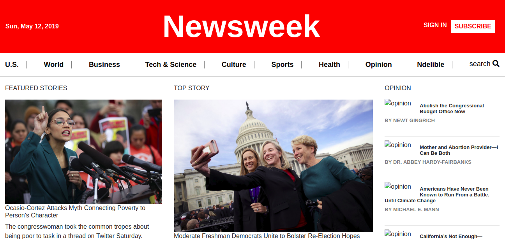

# NewsWeek Magazine Clone

> This project is part of Microverse Training project as a practice of html/css, bootstrap and responsive web design. It consists of cloning the frontend of the Newsweek magazine website, which canbe found [here](https://www.newsweek.com)

## Built With

- HTML
- CSS
- BOOTSTRAP
- RESPONSIVE WEB DESIGN

## Live Demo

[Live Demo Link](https://raw.githack.com/ngodi/NEWSWEEK/development/index.html)

👤 **Author**
Ngodi albert
- Github: [@ngodi](https://github.com/ngodi)
- Twitter: [@albertngodi](https://twitter.com/albertngodi)
- Linkedin: [linkedin](https://www.linkedin.com/in/albert-ngodi-b80267174/)

## 📝 License

This project is [MIT](lic.url) licensed.
